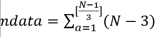

# ERT Surrogate Physics-Driven CNN Inversion

Sistem inversi data *Electrical Resistivity Tomography* (ERT) berbasis
*Convolutional Neural Network* (U-Net) dengan *Surrogate Physics-Driven Loss*.
Model CNN dilatih untuk memprediksi distribusi resistivitas bawah permukaan
dari data *apparent resistivity* pseudosection, dengan kendala konsistensi
fisika ERT yang dihitung secara *fully differentiable* melalui surrogate
forward model (MLP residual) yang terlatih.

---

## Daftar Isi

1. [Deskripsi singkat](#1-deskripsi-singkat)
2. [Konsep dan teori kerja metode](#2-konsep-dan-teori-kerja-metode)
3. [Struktur file](#3-struktur-file)
4. [Persyaratan sistem](#4-persyaratan-sistem)
5. [Instalasi environment](#5-instalasi-environment)
6. [Cara penggunaan langkah demi langkah](#6-cara-penggunaan-langkah-demi-langkah)
7. [Konfigurasi parameter](#7-konfigurasi-parameter)
8. [Output yang dihasilkan](#8-output-yang-dihasilkan)
9. [Cara membaca laporan training](#9-cara-membaca-laporan-training)
   - [9a. Laporan surrogate (train_forward.py)](#9a-laporan-surrogate-train_forwardpy)
   - [9b. Laporan inversion (train_inversion.py)](#9b-laporan-inversion-train_inversionpy)
   - [9c. Memahami validasi](#9c-memahami-validasi)
   - [9d. Kondisi yang mungkin terjadi dan tindakan yang harus diambil](#9d-kondisi-yang-mungkin-terjadi-dan-tindakan-yang-harus-diambil)
10. [Inferensi dan evaluasi model](#10-inferensi-dan-evaluasi-model)
11. [Troubleshooting](#11-troubleshooting)
12. [Catatan penting](#12-catatan-penting)
13. [Refrensi](#13.-refrensi)
14. [Catatan pembuat](#14-catatan-pembuat)
---

## 1. Deskripsi Singkat

```
Input  : Pseudosection apparent resistivity  (grid 40 x 232 piksel)  [0, 1]
Output : Distribusi resistivitas bawah permukaan (grid 40 x 232 piksel) [0, 1]

Metode : Pipeline dua tahap
  Tahap 1 — Latih surrogate forward model  f_theta : m  -->  d
  Tahap 2 — Latih CNN inversion            g_phi   : d  -->  m
             dengan physics loss melalui f_theta yang sudah terlatih
```
## 2. Konsep dan Teori Kerja Metode

### 2.1 Masalah inversi ERT

ERT (*Electrical Resistivity Tomography*) adalah metode geofisika yang mengukur distribusi resistivitas bawah permukaan. Prinsip dasarnya mengikuti hukum Ohm dalam medium homogen, di mana arus listrik I diinjeksikan melalui dua elektroda arus di permukaan, kemudian beda potensial ΔV diukur pada pasangan elektroda potensial. Berdasarkan pengukuran tersebut,  apparent resistivity (*resistivitas semu*) dapat dihitung menggunakan persamaan:

```
rho_a = K * (delta_V / I)
```
di mana K merupakan faktor geometri yang bergantung pada konfigurasi elektroda yang digunakan. Sebagai contoh, pada konfigurasi Wenner-Alpha, dengan spasi elektroda a, faktor geometrinya adalah K=2πa. Nilai resistivitas semu ρa	​yang diperoleh tidak langsung merepresentasikan kondisi resistivitas sebenarnya di bawah permukaan, melainkan merupakan respon rata-rata dari distribusi resistivitas yang kompleks. Oleh karena itu, data ρa biasanya divisualisasikan dalam bentuk pseudosection, dengan kedalaman semu yang secara empiris didekati menggunakan hubungan z=−0.519⋅a.

Selanjutnya, data resistivitas semu tersebut digunakan sebagai input dalam proses inversi untuk memperoleh model resistivitas bawah permukaan yang lebih mendekati kondisi sebenarnya. Proses ini melibatkan penyelesaian forward problem, yaitu mensimulasikan respon potensial listrik berdasarkan model resistivitas tertentu.  Serta inverse problem, yaitu proses menyesuaikan model agar respon hasil simulasi mendekati data observasi.

Masalah inversi ERT merupakan masalah yang bersifat ill-posed, artinya solusi yang diperoleh tidak unik dan sensitif terhadap noise pada data. Banyak model resistivitas m yang dapat menghasilkan data pengukuran d yang hampir identik. Oleh karena itu, diperlukan pendekatan regularisasi untuk menstabilkan solusi. Secara matematis, inversi dilakukan dengan meminimalkan fungsi objektif yang terdiri dari dua komponen utama, yaitu misfit data dan constraint model:
```
Φ(m)=∥dobs−F(m)∥^2 + λ ∥L(m)∥^2
```
di mana F(m) adalah operator forward, λ adalah parameter regularisasi, dan L adalah operator yang mengontrol kekasaran model (misalnya smoothing). Dengan pendekatan ini, model yang dihasilkan tidak hanya cocok terhadap data observasi tetapi juga tetap realistis secara geologi.

### 2.2 Normalisasi logaritmik

Resistivitas tanah memiliki rentang yang sangat lebar (misal:[0.5, 450] Ohm·m).
Normalisasi logaritmik menekan rentang ini ke [0, 1] agar MSE bermakna
proporsional di seluruh rentang nilai:

```
x_norm = (log10(rho) - log10(rho_min)) / (log10(rho_max) - log10(rho_min))

Dengan: rho_min = 0.5 Ohm.m,  rho_max = 450 Ohm.m
```

Normalisasi ini diterapkan secara identik pada: 
(1) pseudosection input CNN,
(2) label model resistivitas, dan 
(3) vektor d_obs yang menjadi target
surrogate. Sehingga semua MSE membandingkan besaran dalam skala yang sama.

### 2.3 Surrogate forward model  f_theta

Surrogate adalah MLP residual yang dilatih untuk meniru perilaku forward
modeling ERT (PyGIMLi). Ia memetakan model resistivitas yang di - *flatten* ke
vektor apparent resistivity:

```
f_theta : m_flat (NZ*NX = 9280)  -->  d_pred (n_data = 360)
```

Jumlah konfigurasi Wenner-Alpha untuk 48 elektroda dihitung dengan rumus:

```
n_data = sum_{a=1}^{floor((N-1)/3)} (N - 3a)
       = sum_{a=1}^{15} (48 - 3a)
       = 45 + 42 + 39 + ... + 3 = 360
```

Surrogate menggunakan **residual blocks** dengan `LayerNormalization` dan
skip connections untuk memastikan gradien mengalir dengan baik saat
backpropagation melewatinya selama training inversion. Dilatih secara
*supervised* menggunakan data pasangan (m, d_obs) yang dihasilkan PyGIMLi:

```
L_surrogate = MSE(d_true, f_theta(m))
```

### 2.4 CNN inversion  g_phi dan physics-driven loss

CNN inversion menggunakan arsitektur **U-Net** yang terdiri dari proses encoder–bottleneck–decoder
dan skip connections untuk memetakan pseudosection ke model resistivitas:

```
g_phi : d_obs (40, 232, 1)  -->  m_pred (40, 232, 1)
```

Setelah surrogate terlatih dan **dibekukan** (bobotnya tidak diupdate), ia
digabungkan dengan g_phi dalam satu pipeline differentiable:

```
d_obs --> g_phi --> m_pred --> f_theta --> d_pred
```

Seluruh pipeline berada dalam satu `tf.GradientTape`, sehingga gradien
dari **physics loss** L_phys mengalir penuh melalui f_theta ke bobot g_phi.
Ini yang membedakan pendekatan surrogate dari subprocess PyGIMLi — pada
subprocess, gradien L_phys terputus di batas proses dan tidak bisa memperbarui
bobot CNN secara langsung.

Total loss yang dioptimasi adalah:

```
L_total = lambda_data * L_data + lambda_phys * L_phys

L_data = MSE(m_true, m_pred)          -- domain model (rekonstruksi)
L_phys = MSE(d_obs,  d_pred)          -- domain data  (fisika)

lambda_data  = 1.0  (bobot domain model)
lambda_phys  = 0.1  (bobot domain data)
```

**L_data** memastikan CNN menghasilkan model yang cocok dengan label sintetik.
**L_phys** memastikan model yang dihasilkan, jika disimulasikan kembali melalui
forward modeling (via surrogate), menghasilkan data yang konsisten dengan data
observasi. Gabungan keduanya mendorong CNN menemukan solusi inversi yang
sekaligus akurat dan konsisten secara fisika.

### 2.5 Optimisasi Adam

Bobot g_phi diperbarui menggunakan algoritma **Adam** yang menggabungkan
*momentum* (momen pertama, m_t) dan *adaptive learning rate* (momen kedua, v_t):

```
g_t   = d(L_total) / d(theta)          -- gradien total loss
m_t   = beta1 * m_{t-1} + (1-beta1) * g_t       -- momen pertama (beta1=0.9)
v_t   = beta2 * v_{t-1} + (1-beta2) * g_t^2     -- momen kedua  (beta2=0.999)
m_hat = m_t / (1 - beta1^t)            -- koreksi bias
v_hat = v_t / (1 - beta2^t)            -- koreksi bias
theta = theta - lr * m_hat / (sqrt(v_hat) + eps)  -- update bobot

lr = 1e-4,  eps = 1e-7
```

Koreksi bias penting di epoch awal karena m_0 = v_0 = 0 menyebabkan
underestimasi nilai momen tanpa koreksi.

### 2.6 Early stopping dan checkpoint

Performa model dipantau melalui `val_data` (MSE rekonstruksi pada data
validasi) setiap akhir epoch. Jika tidak ada perbaikan selama `patience = 20`
epoch, training dihentikan dan bobot dikembalikan ke kondisi terbaik yang pernah
dicapai. Ini mencegah overfitting tanpa memerlukan pengetahuan sebelumnya
tentang kapan model mulai memburuk.

---

## 3. Struktur File

```
project/
|
+-- configs/
|   +-- config.yaml              # Konfigurasi terpusat seluruh project
|
+-- data/
|   +-- raw_pygimli/             # (opsional) data mentah PyGIMLi
|   +-- processed/               # Output generate_dataset.py
|       +-- train/
|       |   +-- X/   X_0000.npy ...   # pseudosection grid  (40,232,1)
|       |   +-- y/   y_0000.npy ...   # true model grid     (40,232,1)
|       |   +-- d_obs/ d_0000.npy ... # vektor rhoa         (360,)
|       +-- val/   (struktur sama)
|       +-- test/  (struktur sama)
|
+-- models/
|   +-- cnn_inversion.py         # Arsitektur U-Net g_phi
|   +-- forward_surrogate.py     # Arsitektur MLP surrogate f_theta
|   +-- saved/                   # Dibuat otomatis saat training
|       +-- surrogate_best.keras
|       +-- surrogate_history.pkl
|       +-- inversion_best.keras
|       +-- inversion_history.pkl
|
+-- scripts/
|   +-- generate_dataset.py      # [env PyGIMLi] Pembangkit dataset
|   +-- train_forward.py         # [env TF] *Train* surrogate f_theta
|   +-- train_inversion.py       # [env TF] *Train* CNN inversion g_phi
|   +-- evaluate.py              # [env TF] Evaluasi dan visualisasi
|
+-- utils/
|   +-- preprocessing.py         # Normalisasi, loader dataset, helper
|   +-- metrics.py               # MSE, MAE, RMSE, R2, SSIM, data misfit
|
+-- results/                     # Dibuat otomatis saat evaluate.py
    +-- metrics_summary.txt
    +-- plots/
    |   +-- sample_0000.png ...
    +-- history_plots/
        +-- surrogate_history.png
        +-- inversion_history.png
```

---

## 4. Persyaratan Sistem

| Komponen | Minimum | Direkomendasikan |
|---|---|---|
| OS | Windows 10 | Windows 11 |
| Python | 3.10 | 3.10 |
| RAM | 8 GB | 16 GB |
| Disk | 5 GB | 10 GB |
| GPU | Tidak wajib | NVIDIA dengan CUDA |
| Conda | Miniconda 3 | Miniconda 3 |

**Dua environment Python terpisah diperlukan** karena PyGIMLi dan TensorFlow
tidak dapat diinstal dalam satu environment yang sama:

| Environment | Digunakan untuk | Script |
|---|---|---|
| `env_pygimli` | Forward modeling ERT (PyGIMLi) | `generate_dataset.py` |
| `env_tf` | Training dan evaluasi (TensorFlow) | `train_forward.py`, `train_inversion.py`, `evaluate.py` |

---

## 5. Instalasi Environment

### 5.1 Environment PyGIMLi (`env_pygimli`)

```python
# Buat environment
conda create -n env_pygimli -c gimli -c conda-forge pygimli python=3.10 -y
#untuk mengaktifkan enviroment
conda activate env_pygimli

# Dependensi tambahan
pip install scipy matplotlib pyyaml

# Verifikasi
python -c "import pygimli; print('PyGIMLi OK:', pygimli.__version__)"
```

### 5.2 Environment TensorFlow (`env_tf`)

```python
# Buat environment (JANGAN install PyGIMLi di sini)
conda create -n env_tf python=3.10 -y
conda activate env_tf

# Dependensi
pip install tensorflow numpy scipy matplotlib pyyaml

# Verifikasi TensorFlow
python -c "import tensorflow as tf; print('TensorFlow OK:', tf.__version__)"

# Verifikasi GPU (opsional)
python -c "import tensorflow as tf; print('GPU:', tf.config.list_physical_devices('GPU'))"
```

> **Catatan:** Jangan menginstal PyGIMLi di `env_tf` atau TensorFlow di
> `env_pygimli` keduanya konflik dan akan menyebabkan error saat import.

---

## 6. Cara Penggunaan

### 1. Siapkan struktur folder

Silakan anda unduh file pada Github ini kemudian pastikan struktur file seperti di bagian 3.
Nantinya semua perintah dijalankan dari root folder project.

### 2. Generate dataset sintetik

Jalankan di environment **PyGIMLi**:

```python
conda activate env_pygimli
cd project/
python scripts/generate_dataset.py
```

Output yang diharapkan:

```
========== DATASET CONFIGURATION ==========
TRAIN : 4000
VAL   : 1142
TEST  :  572
NZ=40  NX=232  N_ELECS=48
============================================

>>> Generating TRAIN
[OK] TRAIN 0000  d_obs shape: (360,)
[OK] TRAIN 0001  d_obs shape: (360,)
...
```

> Proses ini memakan waktu beberapa puluh menit.Pastikan perangkat anda tetap menyala.

**Penting:** Setiap sampel menghasilkan tiga file:
- `X_xxxx.npy`-> pseudosection grid 40×232, input CNN
- `y_xxxx.npy` —> true model grid 40×232 sbagai label CNN
- `d_xxxx.npy` —> vektor rhoa 360 nilai sebagai label surrogate

### 3. Latih surrogate forward model

Jalankan di environment **TensorFlow**:

```python
env_tf\Scripts\activate
python scripts/train_forward.py
```

Surrogate f_theta dilatih secara *supervised* untuk meniru forward modeling
ERT. Harus selesai dan konvergen **sebelum** training inversion dimulai.
Model terbaik disimpan di `models/saved/surrogate_best.keras`.

Output yang diharapkan:

```
============================================================
  TRAINING SURROGATE FORWARD MODEL  f_theta: m -> d
============================================================
  Input dim    : 9280
  Hidden dims  : [1024, 512, 256]
  Output dim   : 360
  ...

============================================================
  SURROGATE EPOCH 1/100
============================================================
  train_loss : 0.089234  (epoch pertama)
  val_mse    : 0.087612  (epoch pertama)
  val_mae    : 0.231405
  best_val   : 0.087612  patience=0/20
```

### 4. Latih CNN inversion

Jalankan di environment **TensorFlow** setelah Langkah 3 selesai:

```python
python scripts/train_inversion.py
```

CNN g_phi dilatih menggunakan surrogate yang sudah terlatih dan dibekukan.
Gradien L_phys mengalir melalui surrogate ke CNN dalam satu GradientTape.

Output yang diharapkan:

```
============================================================
  TRAINING CNN INVERSION  g_phi: d_obs -> m_pred
  dengan surrogate forward  f_theta: m_pred -> d_pred
============================================================
  Surrogate    : models/saved/surrogate_best.keras
  lambda_data  : 1.0
  lambda_phys  : 0.1
  ...

============================================================
  INVERSION EPOCH 1/100
  lam_data=1.0000  lam_phys=0.1000
============================================================
  train_total : 0.045120  (epoch pertama)
  train_data  : 0.038500
  train_phys  : 0.066200
  kontrib_d   : 0.038500  (lam_data x L_data)
  kontrib_p   : 0.006620  (lam_phys x L_phys)
  ────────────────────────────────────────────────────────
  val_total   : 0.043800  (epoch pertama)
  val_data    : 0.037200
  ...
```

### 5. Evaluasi model

```bash
python scripts/evaluate.py
```

Menghasilkan laporan metrik dan visualisasi di folder `results/`.

---

## 7. Konfigurasi Parameter

Semua parameter dikonfigurasi di satu file: `configs/config.yaml`.
**Jangan** mengedit nilai di dalam script secara langsung. Hal ini bertujuan agar semua paramater termanajemen dengan baik, sehingga meminimalisisr adanya error disebabkan perbedaan parameter. 

### Domain fisika

```yaml
domain:
  xmin: -58.5        # batas kiri lintasan (meter)
  xmax:  58.5        # batas kanan lintasan (meter)
  zmin: -20.0        # kedalaman maksimum investigasi (meter)
  zmax:   0.0        # permukaan
  n_electrodes: 48   # jumlah elektroda
  scheme: "wa"       # skema pengukuran: "wa" = Wenner-Alpha
  rho_min:   0.5     # batas bawah normalisasi (Ohm.m)
  rho_max: 450.0     # batas atas normalisasi (Ohm.m)
```
# PENTING!!!
> Jika `n_electrodes` diubah, `output_dim` di bagian surrogate harus
> diperbarui secara manual menggunakan rumus:

### Grid CNN

```yaml
grid:
  nz: 40    # resolusi vertikal grid (piksel)
  nx: 232   # resolusi horizontal grid (piksel)
```

`input_dim` surrogate harus sama dengan `nz * nx`. Jika grid diubah,
perbarui juga `surrogate.input_dim` dan `inversion.input_shape`.

### Dataset

```yaml
dataset:
  n_train: 4000          # jumlah sampel training
  n_val:   1142          # jumlah sampel validasi
  n_test:   572          # jumlah sampel test
  mode_ratio: [2, 3, 5]  # rasio mode A : B : C
  noise_level_min: 0.02  # noise level minimum (2%)
  noise_level_max: 0.10  # noise level maksimum (10%)
```

### Surrogate forward model

```yaml
surrogate:
  input_dim:   9280        # NZ * NX, harus konsisten dengan grid
  hidden_dims: [1024, 512, 256]  # ukuran layer tersembunyi
  output_dim:  360         # n_data Wenner-Alpha untuk 48 elektroda
  dropout:     0.1
  epochs:      100
  batch_size:  32          # naikkan jika GPU memadai (64 atau 128)
  learning_rate: 1.0e-3
  patience:    20
```

### CNN inversion

```yaml
inversion:
  input_shape: [40, 232, 1]
  base_filters: 16         # naikkan ke 32 untuk kapasitas lebih besar
  dropout_bottleneck: 0.3  # naikkan ke 0.4-0.5 jika overfitting
  epochs:       100
  batch_size:   4          # turunkan ke 2 jika RAM terbatas
  learning_rate: 1.0e-4
  patience:     20
  lambda_data:  1.0        # bobot L_data
  lambda_phys:  0.1        # bobot L_phys
```


---

## 8. Output yang Dihasilkan

### Setelah `generate_dataset.py`

```
data/processed/
  train/  X/ X_0000.npy ... X_3999.npy    shape: (40, 232, 1)  float32  [0,1]
          y/ y_0000.npy ... y_3999.npy    shape: (40, 232, 1)  float32  [0,1]
          d_obs/ d_0000.npy ... d_3999.npy  shape: (360,)      float32  [0,1]
  val/    (struktur sama, 1142 sampel)
  test/   (struktur sama,  572 sampel)
```

### Setelah `train_forward.py`

```
models/saved/
  surrogate_best.keras    -- surrogate terbaik (val_mse terendah)
  surrogate_history.pkl   -- {"train_loss": [...], "val_mse": [...], "val_mae": [...]}
```

### Setelah `train_inversion.py`

```
models/saved/
  inversion_best.keras    -- CNN inversion terbaik (val_data terendah)
  inversion_history.pkl   -- {"train_total", "train_data", "train_phys",
                              "val_total", "val_data", "val_phys",
                              "val_mae", "lam_data", "lam_phys"}
```

### Setelah `evaluate.py`

```
results/
  metrics_summary.txt           -- ringkasan numerik semua metrik
  plots/
    sample_0000.png ... sample_N.png   -- visualisasi 6 panel per sampel
  history_plots/
    surrogate_history.png       -- kurva train/val loss surrogate
    inversion_history.png       -- kurva train/val loss semua komponen
```

### Membaca `history_training.pkl`

```python
import pickle
import matplotlib.pyplot as plt

# Surrogate history
with open("models/saved/surrogate_history.pkl", "rb") as f:
    surr_h = pickle.load(f)

# Kunci: "train_loss", "val_mse", "val_mae"
plt.plot(surr_h["train_loss"], label="train")
plt.plot(surr_h["val_mse"],    label="val")
plt.legend(); plt.show()

# Inversion history
with open("models/saved/inversion_history.pkl", "rb") as f:
    inv_h = pickle.load(f)

# Kunci: "train_total", "train_data", "train_phys",
#        "val_total", "val_data", "val_phys", "val_mae",
#        "lam_data", "lam_phys"
plt.plot(inv_h["train_data"], label="L_data train")
plt.plot(inv_h["val_data"],   label="L_data val")
plt.plot(inv_h["train_phys"], label="L_phys train", linestyle="--")
plt.legend(); plt.show()
```

---

## 9. Cara Membaca Laporan Training

### 9a. Laporan surrogate (`train_forward.py`)

Contoh tampilan:

```
============================================================
  SURROGATE EPOCH 5/100
============================================================
  train_loss : 0.031200  -0.008200  (-20.8%)  [v] ||||||||||  [TURUN SIGNIFIKAN]
  val_mse    : 0.029800  -0.007400  (-19.9%)  [v] |||||||||   [TURUN SIGNIFIKAN]
  val_mae    : 0.142300
  best_val   : 0.029800  patience=0/20
  tren(3ep)  : 0.045200 -> 0.037100 -> 0.029800  (menurun)
============================================================
```

| Baris | Arti |
|---|---|
| `train_loss` | MSE rata-rata surrogate pada data training: MSE(d_true, d_pred) |
| `val_mse` | MSE surrogate pada data validasi — penentu checkpoint |
| `val_mae` | Mean Absolute Error validasi — lebih mudah diinterpretasi |
| `best_val` | val_mse terbaik sepanjang training dan hitungan patience |
| `tren(3ep)` | Nilai val_mse tiga epoch terakhir dan arah tren |
| `±x.xxxxxx` | Selisih absolut dibanding epoch sebelumnya |
| `(±x.x%)` | Persentase perubahan |
| `[v]` / `[^]` | Arah perubahan: turun / naik |
| `\|\|\|` | Bar visual proporsional terhadap besar perubahan |
| `[TURUN SIGNIFIKAN]` | Perubahan > 1% |
| `[turun sedikit]` | Perubahan 0.1% – 1% |
| `[STAGNAN]` | Perubahan < 0.1%, perlu perhatian |
| `[NAIK -- periksa!]` | Loss naik, perlu investigasi |

**Surrogate yang baik** menunjukkan `val_mse` turun stabil hingga di bawah
0.01. Jika `val_mse` stagnan di atas 0.05, surrogate belum mampu meniru
forward modeling dengan baik dan physics loss pada training inversion
tidak akan bermakna.

### 9b. Laporan inversion (`train_inversion.py`)

Contoh tampilan:

```
============================================================
  INVERSION EPOCH 8/100
  lam_data=1.0000  lam_phys=0.1000
============================================================
  train_total : 0.041200  -0.003100  (-7.0%)  [v] |||   [TURUN SIGNIFIKAN]
  train_data  : 0.034800  -0.002900  (-7.7%)  [v] |||   [TURUN SIGNIFIKAN]
  train_phys  : 0.064000  -0.008100  (-11.2%) [v] |||||  [TURUN SIGNIFIKAN]
  kontrib_d   : 0.034800  (lam_data=1.0 x L_data=0.034800)
  kontrib_p   : 0.006400  (lam_phys=0.1 x L_phys=0.064000)
  ────────────────────────────────────────────────────────
  val_total   : 0.039500  -0.002800  (-6.6%)  [v] |||   [TURUN SIGNIFIKAN]
  val_data    : 0.033200  -0.002600  (-7.3%)  [v] |||   [TURUN SIGNIFIKAN]
  val_phys    : 0.062100
  val_mae     : 0.128400
  ────────────────────────────────────────────────────────
  gap         : -0.001600  [val < train -- dropout effect]
  best val    : 0.033200  patience=0/20
  tren(3ep)   : 0.041200 -> 0.037800 -> 0.033200  (menurun)
============================================================
```

| Baris | Arti |
|---|---|
| `train_total` | L_total = lam_data * L_data + lam_phys * L_phys |
| `train_data` | L_data = MSE(m_true, m_pred) — domain model (rekonstruksi) |
| `train_phys` | L_phys = MSE(d_obs, d_pred) — domain data (fisika via surrogate) |
| `kontrib_d` | Kontribusi nyata L_data ke total loss = lam_data * L_data |
| `kontrib_p` | Kontribusi nyata L_phys ke total loss = lam_phys * L_phys |
| `val_total` | Total loss pada data validasi |
| `val_data` | L_data validasi —> penentu checkpoint model terbaik |
| `val_phys` | L_phys validasi —> menggunakan surrogate yang sama |
| `val_mae` | Mean Absolute Error validasi domain model |
| `gap` | val_data - train_data —> indikator overfitting |

### 9c. Memahami validasi

Validasi dilakukan menggunakan sampel data yang tidak pernah digunakan selama proses pelatihan (training). 
Tujuannya adalah untuk mengevaluasi kemampuan generalisasi model, yaitu sejauh mana model mampu memberikan 
prediksi yang akurat pada data baru yang belum pernah dilihat sebelumnya.

**Metrik penentu checkpoint:** `val_data` (MSE rekonstruksi pada data
validasi). Bukan `val_total` karena l_phys dihitung melalui surrogate yang
bobotnya tidak berubah. Sehingga perbaikan `val_total` bisa berasal dari
l_phys yang membaik bukan karena CNN lebih baik.

**Pola val_data yang sehat:**

```
Epoch 1-10   : val_data turun cepat, mengikuti train_data
Epoch 10-30  : penurunan melambat tapi konsisten
Epoch 30+    : penurunan sangat kecil, mendekati plateau
gap          : stabil di angka yang sama (tidak terus membesar)
```

**Tentang gap negatif (`val < train`):** Ini normal di awal training karena
dropout aktif saat training (membuat train_data lebih besar) tetapi tidak
aktif saat validasi. Selama val_data masih turun, kondisi ini tidak perlu
dikhawatirkan.

**Hubungan val_data dengan checkpoint dan early stopping:**

```
Setiap epoch:
  Jika val_data < best_val_data:
      simpan inversion_best.keras
      reset patience = 0
  Jika tidak:
      patience += 1
      Jika patience >= 20: hentikan training
```

Selalu gunakan `inversion_best.keras` untuk inferensi, bukan model terakhir.

### 9d. Kondisi yang mungkin terjadi dan tindakan yang dapat diambil

---

**KONDISI 1 :Semua loss turun normal**

```
train_data  : 0.034800  -0.002900  (-7.7%)  [v] |||  [TURUN SIGNIFIKAN]
val_data    : 0.033200  -0.002600  (-7.3%)  [v] |||  [TURUN SIGNIFIKAN]
gap         : -0.001600  [val < train -- dropout effect]
tren(3ep)   : 0.041 -> 0.038 -> 0.033  (menurun)
```

Tindakan: lanjutkan training tanpa perubahan.

---

**KONDISI 2: train_data turun, val_data stagnan atau naik (overfitting)**

```
train_data  : 0.010200  -0.002100  (-17.1%)  [v] ||||||||  [TURUN SIGNIFIKAN]
val_data    : 0.028500  +0.002300  (+8.8%)   [^] ||||  [NAIK -- periksa!]
gap         : +0.018300  [gap besar -- indikasi overfitting]
```

Tindakan:

```python
# Opsi 1: naikkan dropout di configs/config.yaml
inversion:
  dropout_bottleneck: 0.4   # dari 0.3

# Opsi 2: turunkan lambda_phys sementara
inversion:
  lambda_phys: 0.05   # dari 0.1

# Opsi 3: kurangi learning rate
inversion:
  learning_rate: 5.0e-5   # dari 1e-4

# Opsi 4: muat model_best dan lanjutkan dengan lr lebih kecil
import tensorflow as tf
model = tf.keras.models.load_model("models/saved/inversion_best.keras")
```

---

**KONDISI 3 : Loss stagnan sejak awal, hampir tidak turun**

```
train_data  : 0.089100  -0.000050  (-0.1%)  [v] .  [STAGNAN]
val_data    : 0.088900  +0.000010  (+0.0%)  [^] .  [STAGNAN]
```

Tindakan:

```bash
# Langkah 1: periksa dataset
python -c "
import numpy as np, glob
files = glob.glob('data/processed/train/X/*.npy')[:5]
for f in files:
    X = np.load(f)
    print(f, 'range:', round(X.min(),4), '-', round(X.max(),4),
          'NaN:', int(np.isnan(X).sum()))
"
# Hasil normal: range sekitar 0.0 - 1.0, NaN: 0

# Langkah 2: naikkan learning rate
# Di configs/config.yaml:
inversion:
  learning_rate: 5.0e-4   # dari 1.0e-4, naikkan 5x
```

---

**KONDISI 4 : train_phys naik sementara train_data turun**

```
train_data  : 0.028000  -0.003000  (-9.7%)  [v] ||||  [TURUN SIGNIFIKAN]
train_phys  : 0.095000  +0.012000  (+14.4%) [^] |||||||  [NAIK -- periksa!]
```

Ini berarti CNN semakin cocok dengan label tetapi semakin tidak konsisten
secara fisika. Kemungkinan penyebab: surrogate belum cukup terlatih, atau
lambda_phys terlalu besar relatif terhadap skala l_phys.

Tindakan:

```bash
# Langkah 1: pastikan surrogate sudah konvergen
# val_mse surrogate harus < 0.01 sebelum training inversion

# Langkah 2: kurangi lambda_phys di config.yaml
inversion:
  lambda_phys: 0.01   # dari 0.1, turunkan 10x

# Langkah 3: cek konsistensi normalisasi
python -c "
import numpy as np
d = np.load('data/processed/train/d_obs/d_0000.npy')
print('d_obs range:', d.min().round(4), '-', d.max().round(4))
print('d_obs shape:', d.shape)
# Harus: range [0, 1], shape (360,)
"
```

---

**KONDISI 5 : Loss meledak (gradient explosion)**

```
train_total : 4523.812300  +4510.000000  (99.7%)  [^] ||||||||||||||||||||  [NAIK -- periksa!]
```

Tindakan:

```python
# Di configs/config.yaml, tambahkan gradient clipping:
# (perlu modifikasi kecil di train_inversion.py)
optimizer = tf.keras.optimizers.Adam(
    learning_rate=1e-5,
    clipnorm=1.0
)

# Dan turunkan learning rate drastis:
inversion:
  learning_rate: 1.0e-5   # dari 1e-4
```

---

**KONDISI 6 : Early stopping aktif terlalu cepat**

```
best val    : 0.035200  patience=20/20
[STOP] Early stopping epoch 28
```

Tindakan:

```yaml
# Di configs/config.yaml:
inversion:
  patience: 30   # dari 20, beri lebih banyak kesempatan
```

---

**Tabel ringkasan kondisi**

| Kondisi terlihat di laporan | Kemungkinan penyebab | Tindakan prioritas |
|---|---|---|
| Semua loss turun, gap stabil | Training normal | Lanjutkan |
| train turun, val naik, gap membesar | Overfitting | Naikkan dropout, kurangi LR |
| val < train, gap negatif | Dropout effect | Pantau saja, biasanya normal |
| Semua stagnan | LR terlalu kecil / data rusak | Naikkan LR, cek dataset |
| Loss meledak | Gradient explosion | Kurangi LR, tambah clipnorm |
| train_phys naik, train_data turun | Surrogate kurang terlatih / lambda besar | Cek surrogate, kurangi lambda |
| Early stop terlalu cepat | Perbaikan sangat lambat | Naikkan patience atau LR |
| train_phys selalu 0 | Surrogate tidak dimuat | Cek path surrogate_best.keras |
| Surrogate tidak ditemukan | train_forward belum dijalankan | Jalankan train_forward.py dulu |

---

## 10. Inferensi dan Evaluasi Model

### Load model dan prediksi satu sampel

```python
import numpy as np
import tensorflow as tf

# Load model terbaik
inversion = tf.keras.models.load_model("models/saved/inversion_best.keras")
surrogate = tf.keras.models.load_model("models/saved/surrogate_best.keras")

# Load satu sampel test
X     = np.load("data/processed/test/X/X_0000.npy")[np.newaxis]   # (1,40,232,1)
y_true = np.load("data/processed/test/y/y_0000.npy")               # (40,232,1)
d_obs  = np.load("data/processed/test/d_obs/d_0000.npy")           # (360,)

# Prediksi model resistivitas
m_pred = inversion.predict(X)[0]                   # (40, 232, 1)

# Prediksi data via surrogate (untuk cek konsistensi fisika)
m_flat = m_pred.reshape(1, -1)                     # (1, 9280)
d_pred = surrogate.predict(m_flat)[0]              # (360,)

print("MSE model :", np.mean((y_true - m_pred) ** 2))
print("MSE data  :", np.mean((d_obs  - d_pred) ** 2))
```

### Denormalisasi ke satuan Ohm·m

```python
import numpy as np

LOG_MIN = np.log10(0.5)
LOG_MAX = np.log10(450.0)

def denorm(x_norm):
    """Kembalikan nilai ternormalisasi ke resistivitas Ohm.m."""
    return 10.0 ** (LOG_MIN + x_norm * (LOG_MAX - LOG_MIN))

rho_pred_ohm = denorm(m_pred[:, :, 0])   # (40, 232)  Ohm.m
rho_true_ohm = denorm(y_true[:, :, 0])   # (40, 232)  Ohm.m
rhoa_pred_ohm = denorm(d_pred)           # (360,)     Ohm.m
```

### Evaluasi lengkap pada seluruh test set

```python
import sys
sys.path.insert(0, '.')
from utils.metrics import evaluate_batch, print_metrics

# Kumpulkan prediksi seluruh test set terlebih dahulu
# (lihat scripts/evaluate.py untuk contoh lengkap)

# Hitung semua metrik
metrics = evaluate_batch(
    all_m_true, all_m_pred,
    all_d_obs,  all_d_pred
)
print_metrics(metrics, title="Test Set Results")
```

### Plot visualisasi

```python
import matplotlib.pyplot as plt

fig, axes = plt.subplots(1, 3, figsize=(15, 4))

im0 = axes[0].imshow(rho_true_ohm, cmap="jet",
                     vmin=0.5, vmax=450, aspect="auto")
axes[0].set_title("True model (Ohm.m)")
plt.colorbar(im0, ax=axes[0])

im1 = axes[1].imshow(rho_pred_ohm, cmap="jet",
                     vmin=0.5, vmax=450, aspect="auto")
axes[1].set_title("Predicted model (Ohm.m)")
plt.colorbar(im1, ax=axes[1])

diff = np.abs(rho_true_ohm - rho_pred_ohm)
im2 = axes[2].imshow(diff, cmap="hot_r", aspect="auto")
axes[2].set_title("Absolute error (Ohm.m)")
plt.colorbar(im2, ax=axes[2])

plt.tight_layout()
plt.savefig("prediction.png", dpi=150)
plt.show()
```

### Plot kurva training

```python
import pickle
import matplotlib.pyplot as plt

with open("models/saved/inversion_history.pkl", "rb") as f:
    h = pickle.load(f)

fig, axes = plt.subplots(1, 3, figsize=(15, 4))

axes[0].plot(h["train_total"], label="train", color="#7F77DD")
axes[0].plot(h["val_total"],   label="val",   color="#1D9E75")
axes[0].set_title("Total loss"); axes[0].legend(); axes[0].grid(alpha=0.3)

axes[1].plot(h["train_data"], label="train L_data", color="#7F77DD")
axes[1].plot(h["val_data"],   label="val L_data",   color="#1D9E75")
axes[1].set_title("L_data (domain model)"); axes[1].legend(); axes[1].grid(alpha=0.3)

axes[2].plot(h["train_phys"], label="train L_phys", color="#D85A30")
axes[2].plot(h["val_phys"],   label="val L_phys",   color="#BA7517", linestyle="--")
axes[2].set_title("L_phys (domain data)"); axes[2].legend(); axes[2].grid(alpha=0.3)

plt.tight_layout()
plt.savefig("training_history.png", dpi=150)
plt.show()
```

---

## 11. Troubleshooting

### Error: `ValueError: Dimensions must be equal, but are 360 and 658`

Nilai `output_dim` di `configs/config.yaml` salah. Pastikan nilainya 360:

```yaml
surrogate:
  output_dim: 360   # bukan 658 -- rumus: sum(48-3a, a=1..15) = 360
```

Hapus dataset lama jika sudah di-generate dengan config yang salah,
kemudian generate ulang:

```bash
rm -rf data/processed/
python scripts/generate_dataset.py
```

### Error: `FileNotFoundError: Surrogate tidak ditemukan`

`train_inversion.py` membutuhkan surrogate yang sudah terlatih. Jalankan
`train_forward.py` terlebih dahulu:

```bash
python scripts/train_forward.py
# Tunggu hingga selesai dan surrogate_best.keras tersimpan
python scripts/train_inversion.py
```

### Error: `ModuleNotFoundError: No module named 'pygimli'`

Script `generate_dataset.py` harus dijalankan di environment PyGIMLi:

```bash
conda activate env_pygimli   # BUKAN env_tf
python scripts/generate_dataset.py
```

### Error: `UnicodeEncodeError` di Windows

Tambahkan environment variable sebelum menjalankan script:

```bash
# Command Prompt
set PYTHONIOENCODING=utf-8
python scripts/train_forward.py

# PowerShell
$env:PYTHONIOENCODING = "utf-8"
python scripts/train_forward.py
```

### Surrogate val_mse tidak turun di bawah 0.05

Surrogate belum mampu mempelajari hubungan forward modeling dengan baik.
Kemungkinan penyebab: dataset terlalu kecil atau arsitektur terlalu kecil.

```yaml
# Di configs/config.yaml:
surrogate:
  hidden_dims: [2048, 1024, 512, 256]   # tambah kapasitas
  batch_size:  64                        # naikkan batch size
  learning_rate: 5.0e-4                 # turunkan LR sedikit
  epochs: 200                           # beri waktu lebih lama

dataset:
  n_train: 8000   # naikkan jumlah data jika memungkinkan
```

### Kehabisan RAM saat training inversion

```yaml
# Di configs/config.yaml:
inversion:
  batch_size: 2   # dari 4 ke 2
```

### Hasil prediksi terlihat blur atau kurang tajam

```yaml
# Di configs/config.yaml:
inversion:
  base_filters: 32   # dari 16 ke 32, naikkan kapasitas U-Net
```

---

## 12. Catatan Penting

### Parameter yang harus konsisten di semua komponen

Parameter berikut harus memiliki nilai yang identik antara `config.yaml`,
dataset yang di-generate, dan model yang dibangun. Jika salah satu diubah
tanpa yang lain, akan terjadi error dimensi atau hasil yang tidak valid:

| Parameter | Nilai default | Berlaku di |
|---|---|---|
| `domain.n_electrodes` | 48 | generate_dataset, surrogate output_dim |
| `domain.rho_min` | 0.5 | generate_dataset, preprocessing.normalize |
| `domain.rho_max` | 450.0 | generate_dataset, preprocessing.normalize |
| `grid.nz` | 40 | generate_dataset, inversion input_shape, surrogate input_dim |
| `grid.nx` | 232 | generate_dataset, inversion input_shape, surrogate input_dim |
| `surrogate.input_dim` | 9280 | surrogate (= nz * nx) |
| `surrogate.output_dim` | 360 | surrogate (= n_wenner_alpha(48)) |
| `inversion.input_shape` | [40, 232, 1] | CNN inversion |

### Urutan pelatihan yang wajib dipatuhi

```
1. generate_dataset.py   (env_pygimli)  -- buat data
2. train_forward.py      (env_tf)       -- latih surrogate DULU
3. train_inversion.py    (env_tf)       -- latih CNN (butuh surrogate)
4. evaluate.py           (env_tf)       -- evaluasi
```

Training inversion (`train_inversion.py`) akan gagal jika
`models/saved/surrogate_best.keras` belum ada.

### Tentang gradien physics yang fully differentiable

Pada pendekatan ini, `train_step` di `train_inversion.py` menggunakan
**satu GradientTape** yang mencakup seluruh pipeline g_phi → f_theta:

```python
with tf.GradientTape() as tape:
    m_pred = inversion(X_obs, training=True)         # g_phi
    m_flat = tf.reshape(m_pred, [B, -1])
    d_pred = surrogate_model(m_flat, training=False)  # f_theta (dibekukan)
    l_phys = MSE(d_obs_vec, d_pred)
    l_data = MSE(m_true, m_pred)
    l_total = lam_data * l_data + lam_phys * l_phys

# Hanya update g_phi, bukan f_theta
grads = tape.gradient(l_total, inversion.trainable_variables)
```

Meskipun surrogate dibekukan (`trainable=False`), ia tetap berada di
dalam `GradientTape` sehingga gradien dari L_phys dapat mengalir
**melalui** f_theta ke bobot g_phi. Ini adalah perbedaan fundamental
dari pendekatan subprocess di mana gradien L_phys terputus di batas proses.

### Mengganti jumlah elektroda

Jika jumlah elektroda diubah (mis. dari 48 ke 36), hitung ulang `output_dim`:

```python
def n_wenner_alpha(n):
    return sum(n - 3*a for a in range(1, n) if n - 3*a > 0)

print(n_wenner_alpha(36))  # 198
print(n_wenner_alpha(48))  # 360
print(n_wenner_alpha(60))  # 570
```

Kemudian perbarui `configs/config.yaml`:

```yaml
domain:
  n_electrodes: 36   # ganti sesuai kebutuhan

surrogate:
  output_dim: 198    # = n_wenner_alpha(36)
```

Dan generate ulang seluruh dataset karena `d_xxxx.npy` memiliki dimensi
berbeda.

---

## 13. Referensi
Shahriari,M.,(2020) A Deep Neural Network as Surrogate Model for Forward Simulation of Borehole Resistivity Measurements, Elsevier https://www.sciencedirect.com/science/article/pii/S2351978920306399?via%3Dihub

Liu,Bin.,dkk.,(2020),Deep Learning Inversion of Electrical Resistivity Data, IEEE
https://ieeexplore.ieee.org/document/8994191

Liu,Bin.,dkk.,(2023),Physics-Driven Deep Learning Inversion for Direct Current Resistivity Survey Data, IEEE
https://ieeexplore.ieee.org/document/10091223


## 14. Catatan pembuat
Skrip ini masih berada dalam tahap uji coba dan pengembangan. Hasil analisis serta rekomendasi tindakan yang disajikan 
masih bersifat hipotesis, yang diperoleh melalui proses *trial and error* selama penyusunan skrip. Apabila Anda memiliki 
saran, masukan, atau ingin berdiskusi lebih lanjut, silakan menghubungi pembuat melalui alamat email berikut: cakraalam08@gmail.com

